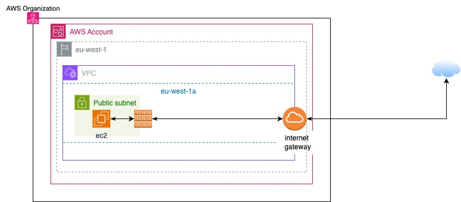

# Bolt
This repository containing the Cloud Security Engineer home task for Bolt interview.

The web application infrastructure is a basic ec2 server deployed in a private network (VPC) with an internet gateway to provide internet access.
A security group and a route table are used to secure and filter the traffic from and to the ec2 server.

The architecture is shown below :

